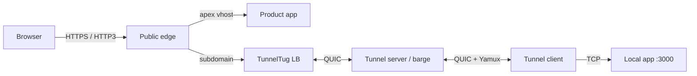
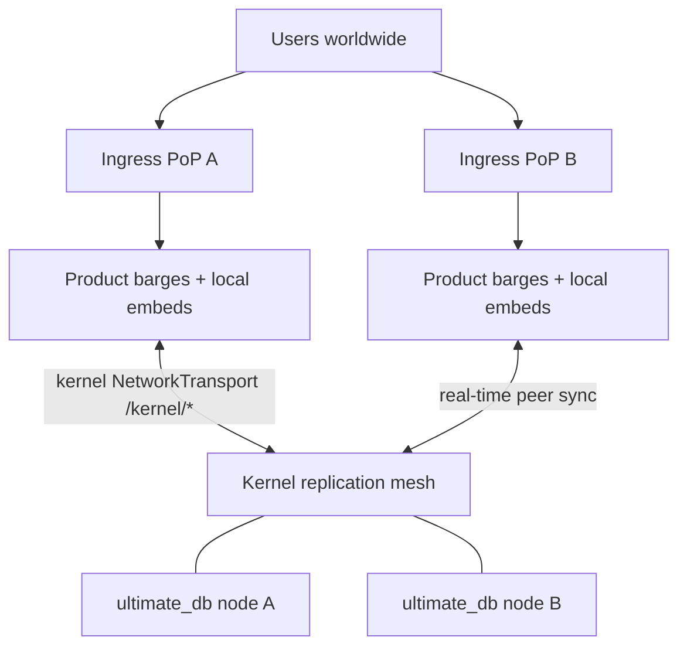

# TunnelTug

[](LICENSE)

**TunnelTug scales from local development to geo-distributed anycast production ingress — with real-time data sync across global edges.**

It exposes local HTTP services through a **QUIC control tunnel** and a **streaming-optimized public edge**, then grows into load-balanced **barges**, k3s fleets, product **vhosts**, **mesh** registration, multi-region **anycast**, and a **kernel replication plane** so every ingress keeps local data *and* stays in sync worldwide—without changing how you ship.

**License:** [MIT](LICENSE) — free to use, modify, and distribute.

## Features

- **QUIC control channel** — Clients connect over UDP with TLS (`ALPN: tunneltug`)
- **Yamux multiplexing** — Many concurrent HTTP/WebSocket streams over one control connection
- **Streaming ingress** — Reverse proxy tuned for SSE, long bodies, and WebSocket upgrades
- **HTTP/3 public edge** — QUIC ingress with Alt-Svc; WebSocket upgrades on H3 supported
- **ACME / Let's Encrypt** — Automatic certificates in `-prod`
- **Subdomain or direct routing** — Multi-tenant hosts or a single shared tunnel
- **Load balancer** — Sticky or round-robin backends; dynamic barge registration
- **Barge fleets** — Horizontal tunnel backends; **k3s by default** (production), `process` for local development
- **k3s barges** — Rolling StatefulSet pods that self-register with the LB (stay up across other deploys)
- **Orchestrator** — Namespace-aware control + ingress for multi-fleet ops
- **Product vhosts** — Co-host apex/www apps next to tunnel subdomains (`-vhosts`)
- **Built-in mesh** — `secure_dns` + `secure_registrar` private zone (default `*.tunneltug.tunnel`) without an external platform
- **VPI stub** — Local resolver for private TLDs (`.tunnel` / `.mesh` / `.social`)
- **Anycast edge** — BGP health-gated split-horizon DNS face (`-mode anycast` or `-anycast` sidecar on server/lb)

## Architecture



### Scale-out idea: global ingresses + real-time sync

| Layer | Job |
|-------|-----|
| **Anycast / multi-PoP ingress** | Users hit the nearest edge (BGP health-gated DNS, LB, barge fleets) |
| **Local embeds** | Each product barge serves from local ultimate_db / keystore (low latency) |
| **Kernel replication barges** | Peers across regions; products `AddPeer` so service data **replicates in real time** |
| **Not** | One central remote DB that edges “prefer over” local |



YAML `domain` / stack config per PoP; kernel `node_id` + `peers` wire the replication mesh so scale-out is more ingresses, not a single shared primary.

| Port | Protocol | Purpose |
|------|----------|---------|
| `443` / `-public` | TCP (HTTPS), UDP (HTTP/3) | Public HTTP ingress |
| `9000` / `-control` | UDP (QUIC) | Tunnel control channel |
| `80` | TCP | ACME HTTP-01 (`-prod`, when `-acme-http`) |

## Modes

| Mode | Purpose |
|------|---------|
| `client` | Expose local `-local` as a public subdomain (or mesh host) |
| `server` | Accept tunnels + serve public ingress (or backend behind LB) |
| `lb` | Front many servers; sticky/RR + dynamic barge registration |
| `barge` | Fleet of server backends (**k3s** default; `process` for dev) |
| `orchestrator` | Namespace-aware LB + control plane |
| `anycast` | Multi-PoP anycast edge: split-horizon DNS + BGP announce/withdraw |
| `hub` | OCI registry (`hub.tunneltug.com`); public pull, auth push; blobs on 0trust.social S3 |
| `hub-publish` | Push local k3s images for mail/search/platform/services/social/barge to the hub |

### Anycast edge (built-in)

Health-gated BGP anycast for the private TLD / DoH face. Same binary as tunnel modes.

**Standalone (dry-run BGP log backend):**

```bash
./bin/tunneltug -mode anycast -anycast-config config/anycast.local.yaml
```

**Sidecar on server or LB:**

```bash
./bin/tunneltug \
  -mode server \
  -mesh \
  -anycast \
  -anycast-config config/anycast.example.yaml \
  -token "<token>" \
  ...
```

| Flag / env | Purpose |
|------------|---------|
| `-mode anycast` | Run only the anycast edge |
| `-anycast` | Enable sidecar (server/lb) |
| `-anycast-config` / `TUNNELTUG_ANYCAST_CONFIG` | YAML (see `config/anycast.example.yaml`) |
| `TUNNELTUG_ANYCAST=1` | Same as `-anycast` |
| `-anycast-gen-bgpsec-key path` | Write ECDSA P-256 **BGPsec router** key PEM + print SKI (not ACME) |

Status API (from YAML `listen`, default `127.0.0.1:9099`): `GET /health`, `/ready`, `/status`.  
BGP backends: `log` (default dry-run), `exabgp`, `bird`, `file`.

#### Routing security (ROV + BGPsec)

Announces are **fail-closed** when security is enabled:

1. **ROV (RPKI origin validation)** — refuse prefixes your origin ASN is not authorized to announce (`bgp.security.rov`).
2. **BGPsec origin signing** — sign each prefix in-process with an **RPKI BGPsec router key** (ECDSA P-256, RFC 8205/8208 suite 1). This is **not** the ACME/TLS key.

```bash
# Lab key (enroll under RPKI for production ASN)
./bin/tunneltug -anycast-gen-bgpsec-key config/bgpsec-router.lab.key

./bin/tunneltug -mode anycast -anycast-config config/anycast.local.yaml
# curl -s http://127.0.0.1:19099/status | jq .bgp.security
```

`/ready` is 200 only when health is good **and** routes are announced (ROV + BGPsec gates passed).

### Shadow profile (extra suffixes + zone pack)

Same anycast loop; put public-looking labels in `dns.private_suffixes`, seed records with `dns.zone_pack`, optional `origin` HTTP face.

```bash
./bin/tunneltug -mode anycast -anycast-config config/shadow.example.yaml
# dig @127.0.0.1 -p 15353 www.example.com +short
# curl -s http://127.0.0.1:19099/status
```

See `config/shadow.example.yaml` and `deploy/shadow/`.

## Quick start

### Build

```bash
git clone https://github.com/TunnelTug/tunneltug.git
cd tunneltug
make build
```

### Development (self-signed TLS)

**Server:**

```bash
./bin/tunneltug \
  -mode server \
  -dev \
  -domain localhost \
  -token "$(./bin/tunneltug -gen-token)" \
  -public 8443
```

**Client:**

```bash
./bin/tunneltug \
  -mode client \
  -server 127.0.0.1 \
  -control 9000 \
  -local 3000 \
  -subdomain myapp \
  -token "<same-token>" \
  -insecure
```

Visit `https://myapp.localhost:8443` (add `127.0.0.1 myapp.localhost` to `/etc/hosts` if needed).

### Production (simple direct tunnel)

Single shared tunnel on the apex domain — no subdomains, no mesh required:

**Server** (DNS `A`/`AAAA` for `example.com`, open 80, 443/tcp, 443/udp, control/udp):

```bash
./bin/tunneltug \
  -mode server \
  -prod \
  -routing direct \
  -domain example.com \
  -email admin@example.com \
  -token "$(./bin/tunneltug -gen-token)"
```

**Client:**

```bash
./bin/tunneltug \
  -mode client \
  -prod \
  -routing direct \
  -domain example.com \
  -local 3000 \
  -token "<same-crypto-token>"
```

Visit `https://example.com` (and `https://www.example.com` when DNS points there).

### Production (subdomain routing)

**Server** (include a wildcard or per-host SANs for ACME):

```bash
./bin/tunneltug \
  -mode server \
  -prod \
  -domain example.com \
  -subalt '*.example.com' \
  -email admin@example.com \
  -token "$(./bin/tunneltug -gen-token)"
```

**Client:**

```bash
./bin/tunneltug \
  -mode client \
  -server tunnel.example.com \
  -domain example.com \
  -subdomain myapp \
  -local 3000 \
  -token "<same-token>"
```

## Custom TLDs / domains + DoH (YAML)

Point the local VPI DNS stub at **your** private TLDs and domains, each with its own **DNS-over-HTTPS** resolver (RFC 8484) or classic `host:port` upstream.

```bash
./bin/tunneltug -mode client \
  -server tunnel.example.com -local 3000 -subdomain myapp -token "$TOKEN" \
  -dns config/dns.yaml
```

Or set `TUNNELTUG_DNS=/path/to/dns.yaml`. Loading a DNS file enables the stub automatically (`-vpi-stub`).

```yaml
# config/dns.yaml (see config/dns.example.yaml)
listen: 127.0.0.1:5354
fallback: https://cloudflare-dns.com/dns-query   # or 8.8.8.8:53

zones:
  - tld: corp
    doh: https://dns.corp.example/dns-query

  - domains:
      - services.internal
      - "*.lab.internal"
    doh: https://doh.lab.example/dns-query

  - tld: tunnel
    domains:
      - tunneltug.tunnel
    upstream: 127.0.0.1:5353          # classic DNS; optional doh + upstream fallback
```

| Field | Purpose |
|-------|---------|
| `listen` | Local UDP stub address (default `-vpi-listen`) |
| `fallback` | Resolver when no zone matches (`host:port` or DoH URL) |
| `default_doh` / `default_upstream` | Used when a zone matches but omits its own resolver |
| `private_tlds` | Extra private labels without a dedicated zone block |
| `zones[].tld` | Single label (e.g. `corp`) — matches `*.corp` |
| `zones[].domains` | Exact names, suffixes, or `*.suffix` patterns |
| `zones[].doh` | DoH base URL (`POST` `application/dns-message` by default) |
| `zones[].doh_method` | `post` (default) or `get` |
| `zones[].upstream` | Classic DNS `host:port` (also DoH failure fallback) |

Match preference: exact domain → domain suffix / wildcard → TLD. Point the OS or app resolver at the stub listen address for private names.

## Built-in mesh network

TunnelTug embeds **secure_dns** + **secure_registrar** so a server (or LB) can operate its own private mesh zone without 0Trust platform. Default product zone: `tunneltug.tunnel` under TLD `.tunnel`.

**Server (authority):**

```bash
./bin/tunneltug -mode server -dev -domain localhost -public 8443 \
  -token "$TOKEN" -mesh -mesh-dns 127.0.0.1:5353 -mesh-edge-ip 127.0.0.1
```

On each tunnel connect, the authority publishes `{subdomain}.tunneltug.tunnel` → edge IP.

**Client (publish + local resolve):**

```bash
./bin/tunneltug -mode client \
  -server 127.0.0.1 -control 9000 -public 8443 \
  -domain localhost -subdomain myapp -local 3000 \
  -token "$TOKEN" -insecure -mesh
```

- Private name: `myapp.tunneltug.tunnel`
- VPI stub (auto-on with `-mesh`): `127.0.0.1:5354` → forwards private TLDs to mesh DNS
- HTTP registry: `GET /_tunneltug/mesh/status`, `POST /_tunneltug/mesh/register` (token auth)

Optional external platform join (legacy/advanced): add `-mesh-join-platform` and/or `-mesh-gateway` / `-mesh-pubkey`.

## Load balancer + barge

```bash
# LB
./bin/tunneltug -mode lb -domain example.com -subalt '*.example.com' \
  -public 8444 -control 9000 -lb-dynamic=true -lb-policy sticky \
  -prod -acme-http=false -token "$TOKEN"

# Production: k3s is the default barge runtime (rolling pods, no hard fleet reset)
./bin/tunneltug -mode barge -barge-service server -barge-replicas 2 \
  -control 9001 -public 8445 -barge-port-step 1 \
  -barge-lb lb.example.com:8444 \
  -k3s-image tunneltug:1.2.3 \
  -k3s-kubeconfig /etc/rancher/k3s/k3s.yaml \
  -token "$TOKEN" -domain example.com -backend-insecure

# Development only: local multi-process supervisor
./bin/tunneltug -mode barge -barge-runtime process -barge-service server -barge-replicas 2 \
  -control 9001 -public 8445 -barge-host 127.0.0.1 \
  -barge-lb 127.0.0.1:8444 -token "$TOKEN"
```

LB registration endpoints: `POST /_tunneltug/lb/register`, `/heartbeat`, `/deregister`.

### k3s barges (production default)

`-barge-runtime` defaults to **`k3s`**. Each replica is a StatefulSet pod with **hostNetwork**, ordinal ports, and **self-registration** so:

- Other host services can update without stopping barges
- Barge image rolls replace one pod at a time (LB keeps ≥ N−1 backends)
- Requires `-k3s-image` (or `TUNNELTUG_K3S_IMAGE`) and a reachable cluster

```bash
# Controller reconciles StatefulSet (pods keep running if controller exits)
./bin/tunneltug -mode barge -barge-replicas 2 \
  -control 9001 -public 8445 -barge-lb lb.example.com:8444 \
  -k3s-image tunneltug:dev \
  -k3s-kubeconfig /etc/rancher/k3s/k3s.yaml \
  -token "$TOKEN" -domain example.com -backend-insecure

# Or apply static manifests
kubectl apply -f deploy/k3s/
kubectl -n tunneltug set image sts/tunneltug-barge tunneltug=tunneltug:1.2.4
```

Use **`-barge-runtime process`** only for local development (one parent, N children; restart kills the whole fleet).

Each pod runs `-mode server -index-from-hostname -register-lb …` with `TUNNELTUG_REGISTER_HOST` from the node IP (Downward API). See `deploy/k3s/README.md`.

Server self-registration (any environment):

```bash
./bin/tunneltug -mode server -control 9001 -public 8445 \
  -register-lb lb.example.com:8444 -register-host 10.0.0.5 \
  -token "$TOKEN"
```

### Barge / server snapshots

Enable durable tunnel inventory across restarts and rolling updates:

```bash
./bin/tunneltug -mode server \
  -snapshot-dir /var/lib/tunneltug/snapshots \
  -snapshot-on-shutdown -snapshot-restore \
  ...
```

| When | What |
|------|------|
| SIGTERM / roll | Write JSON snapshot (tunnels, ports, LB, mesh flag) |
| Start | Restore mesh publishes + mark tunnels **pending reconnect** |
| k3s controller image change | `POST /_tunneltug/snapshot` on ready pods first |
| Manual | `POST /_tunneltug/snapshot` with `X-TunnelTug-Token` |

Live QUIC/yamux sessions are not serializable — clients reconnect; snapshot keeps DNS/mesh and ops visibility (`pending_tunnels` on `/_tunneltug/health`).

## Product vhosts (server / lb)

Co-host product apex domains next to tunnel subdomains:

```yaml
# config/vhosts.example.yaml
platform_url: https://0trust.cloud
cloud_domain: 0trust.cloud
acme_domains:
  - tunneltug.com
vhosts:
  - domain: tunneltug.com
    upstream: http://127.0.0.1:3082
    auth_proxy: false
    wildcard_subdomains: false   # myapp.tunneltug.com stays a tunnel
```

```bash
./bin/tunneltug -mode server -prod -domain tunneltug.com \
  -email admin@example.com -token "$TOKEN" \
  -vhosts config/vhosts.yaml
```

| Host | Route |
|------|--------|
| `tunneltug.com` / `www` | Product vhost → upstream |
| `myapp.tunneltug.com` | Tunnel when `wildcard_subdomains: false` |
| `site.motionkb.com` | Vhost when `wildcard_subdomains: true` |

Optional `auth_proxy: true` proxies `/auth/*`, `/samln/*`, and related IdP paths to `platform_url`. Use `upstream: "cloud://8443"` with `cloud_backhaul` for private platform hops.

## Configuration

### Core flags

| Flag | Default | Description |
|------|---------|-------------|
| `-mode` | `client` | `server`, `client`, `lb`, `barge`, `orchestrator`, `anycast`, `hub` |
| `-routing` | `subdomain` | `subdomain` or `direct` |
| `-token` | — | Cryptographic auth secret (min 16; 32 in `-prod`). Empty auto-mints in non-prod |
| `-gen-token` | `false` | Print a crypto/rand 256-bit token and exit |
| `-control` | `9000` | QUIC control port (UDP) |
| `-public` | `8080` | Public HTTP(S)/HTTP/3 port |
| `-local` | `3000` | Local app port (client) |
| `-subdomain` | `myapp` | Tunnel name |
| `-namespace` | `default` | Logical namespace |
| `-domain` | — | Primary domain (`-prod` / `-dev`) |
| `-subalt` | — | Extra SANs |
| `-prod` / `-dev` | `false` | ACME or self-signed TLS |
| `-http3` | `true` | HTTP/3 when TLS enabled |
| `-vhosts` | — | Product vhost YAML/JSON |
| `-insecure` | `false` | Skip TLS verify (client, dev only) |
| `-version` | — | Print version |

### LB / barge / mesh flags

| Flag | Default | Description |
|------|---------|-------------|
| `-backends` | — | `host[:control[:public]]` list |
| `-lb-policy` | `sticky` | `sticky` or `round-robin` |
| `-lb-dynamic` | `true` | Accept barge registration |
| `-lb-register-ttl` | `45` | Prune unresponsive barges (s) |
| `-barge-service` | `server` | `server` or `client` |
| `-barge-replicas` | `1` | Process/pod count |
| `-barge-runtime` | `k3s` | `k3s` (production) or `process` (development) |
| `-barge-lb` | — | LB `host:port` for registration |
| `-barge-fleet-id` | — | Fleet id on heartbeats |
| `-k3s-image` | hub default | Barge pod image (`hub.tunneltug.com/tunneltug/barge:latest`) |
| `-k3s-hub` | `true` | Embed barge image hub in k3s controller |
| `-k3s-hub-pull` | `true` | `k3s ctr pull` image before reconcile |
| `-k3s-hub-publish` | — | Local image to push to hub |
| `-hub-listen` | `:5000` | Hub bind (k3s layer) |
| `-hub-public` | `https://hub.tunneltug.com` | Public registry URL |
| `-hub-s3-url` | `https://0trust.social` | S3 CDN for blobs |
| `-hub-bucket` | `tunneltug-hub` | S3 bucket |
| `-k3s-kubeconfig` | — | Kubeconfig (else in-cluster / `~/.kube/config`) |
| `-k3s-namespace` | `tunneltug` | Workload namespace |
| `-k3s-host-network` | `true` | hostNetwork for QUIC (recommended) |
| `-k3s-cleanup` | `false` | Delete StatefulSet when controller exits |
| `-k3s-stack` | `false` | With barge k3s: also reconcile product stack |
| `-stack-config` | — | YAML listing configurable product barges (see `config/stack.example.yaml`) |
| `-barge-config` | — | Alias for `-stack-config` (SRE: load barge with yaml) |
| `-stack-products` | default apps | Comma list for `-mode stack` when no YAML |
| `-stack-namespace` | `0trust-stack` | Product stack namespace |
| `-register-lb` | — | Server self-registration LB `host:port` |
| `-register-host` | — | Address advertised to LB (node IP on k3s) |
| `-index-from-hostname` | `false` | Port base + step from hostname `…-N` |
| `-snapshot-dir` | — | Dir for barge/server state snapshots (empty = off) |
| `-snapshot-on-shutdown` | `true` | Write snapshot before graceful exit |
| `-snapshot-restore` | `true` | Restore latest snapshot on server start |
| `-snapshot-interval` | `0` | Periodic snapshot seconds (`0` = off) |
| `-snapshot-keep` | `5` | Snapshots retained per identity |
| `-mesh` | `false` | Built-in mesh DNS+registrar (server/lb authority; client publish) |
| `-mesh-dns` | `127.0.0.1:5353` | Authoritative mesh DNS listen (server/lb) |
| `-mesh-zone` | `tunneltug.tunnel` | Product root zone |
| `-mesh-tld` | `tunnel` | Private TLD |
| `-mesh-edge-ip` | auto | A-record edge IP |
| `-mesh-join-platform` | `false` | Also join external 0Trust platform mesh |
| `-vpi-stub` | `false` | Local private-TLD DNS stub (auto with `-mesh` client or `-dns`) |
| `-vpi-upstream` | mesh-dns | Authoritative NS for private names |
| `-vpi-listen` | `127.0.0.1:5354` | Stub listen address |
| `-dns` | — | YAML/JSON custom TLDs/domains + DoH zones |
| `-acme-http` | `true` | Bind `:80` for ACME |
| `-acme-cache` | `certs-cache` | Cert cache directory |

### Environment variables

| Variable | Maps to |
|----------|---------|
| `TUNNELTUG_TOKEN` | `-token` (weak values rejected) |
| `TUNNELTUG_K3S_IMAGE` | `-k3s-image` |
| `TUNNELTUG_HUB_LISTEN` | `-hub-listen` |
| `TUNNELTUG_HUB_PUBLIC` | `-hub-public` |
| `TUNNELTUG_HUB_S3_URL` | `-hub-s3-url` |
| `TUNNELTUG_HUB_BUCKET` | `-hub-bucket` |
| `TUNNELTUG_DOMAIN` | `-domain` |
| `TUNNELTUG_SERVER` | `-server` |
| `TUNNELTUG_SUBDOMAIN` | `-subdomain` |
| `TUNNELTUG_BACKENDS` | `-backends` |
| `TUNNELTUG_VHOSTS` | `-vhosts` |
| `TUNNELTUG_BARGE_LB` | `-barge-lb` |
| `TUNNELTUG_BARGE_FLEET_ID` | `-barge-fleet-id` |
| `TUNNELTUG_MESH` | `-mesh` |
| `TUNNELTUG_MESH_DNS` | `-mesh-dns` |
| `TUNNELTUG_MESH_ZONE` | `-mesh-zone` |
| `TUNNELTUG_MESH_TLD` | `-mesh-tld` |
| `TUNNELTUG_MESH_EDGE_IP` | `-mesh-edge-ip` |
| `TUNNELTUG_MESH_JOIN_PLATFORM` | `-mesh-join-platform` |
| `TUNNELTUG_MESH_PLATFORM` | `-mesh-platform` |
| `TUNNELTUG_MESH_GATEWAY` | `-mesh-gateway` |
| `TUNNELTUG_MESH_PUBKEY` | `-mesh-pubkey` |
| `TUNNELTUG_VPI_STUB` | `-vpi-stub` |
| `TUNNELTUG_VPI_UPSTREAM` | `-vpi-upstream` |
| `TUNNELTUG_VPI_LISTEN` | `-vpi-listen` |
| `TUNNELTUG_DNS` | `-dns` |
| `TUNNELTUG_CONFIG` | `-config` (site YAML or Tugconf) |
| `TUNNELTUG_POP` | `-pop` (multi-PoP site selection) |

## Architectures & resilient designs

See **[docs/ARCHITECTURES.md](docs/ARCHITECTURES.md)** for deployment shapes (dev tunnel → multi-PoP anycast + kernel mesh) and resilient combos (R1–R5).

On **[hub.tunneltug.com](https://hub.tunneltug.com)** each catalog image has a **Configure** modal: pick an architecture, scale replicas, link other services (or multiple instances of the same), preview **YAML** and **Tugconf**, then **Scale & link** / copy / download. Catalog JSON: `GET /_tunneltug/hub/catalog`.

## Site config & Tugconf (complex multi-PoP)

One document can describe **global ingresses** (anycast/LB/barge per PoP), product stacks, and a **kernel peer mesh** for real-time data sync. Local embeds stay primary; kernel peers replicate.

| Flag | Purpose |
|------|---------|
| `-config path` | Site YAML **or** Tugconf (`.tug` / `.set` / set-style file) |
| `-pop id` | Which PoP this process is (`sfo`, `ams`, …) |
| `-config-check` | Expand + print run plan (kernel peers, roles, paths); exit |
| `-config-show-set` | Dump config as Junos-like `set` lines; exit |

**YAML** (`config/site.example.yaml`):

```bash
tunneltug -config config/site.example.yaml -pop sfo -config-check
tunneltug -config config/site.example.yaml -pop sfo -mode stack -token "$TOKEN"
```

**Tugconf** — Junos-like hierarchical language, same IR (`config/site.example.tug`):

```
set site domain example.com
set kernel_mesh mode full-mesh
set pop sfo roles [anycast,lb,barge,stack,kernel]
set pop sfo kernel ultimate_db node_id udb-sfo
set pop sfo kernel ultimate_db url https://kernel-db.sfo.example.com:8480
set pop ams kernel ultimate_db node_id udb-ams
set pop ams kernel ultimate_db url https://kernel-db.ams.example.com:8480
```

```bash
tunneltug -config config/site.example.tug -pop sfo -config-check
```

| Tugconf command | Effect |
|-----------------|--------|
| `set <path> <value>` | Set a leaf (paths space-separated) |
| `delete <path>` | Remove a node |
| `load override\|merge\|set <file>` | Pull in YAML or another `.tug` |
| `# comment` | Ignored |

`kernel_mesh.mode`:

| Mode | Peer expansion |
|------|----------------|
| `full-mesh` | Every PoP peers with every other PoP that has `kernel.*.url` |
| `hub-spoke` | Spokes peer only with `hub_pop`; hub peers with all spokes |
| `manual` | No auto peers — use per-node `peers:` only |

Precedence: **CLI flags > env > site file**. Secrets via `site.token_env` (default `TUNNELTUG_TOKEN`), not inline YAML.

## Hub + k3s fleets (what “barge” means)

**Barge** = TunnelTug operating a **k3s fleet** of tunnel servers.  
Not an app product. Fleet pods run the **TunnelTug engine** image; the hub is embedded in that controller.

```bash
tunneltug -mode barge -barge-runtime k3s ...
```

| | |
|--|--|
| **Hub** | Embedded (`-k3s-hub`, default on) |
| **Engine image** | `hub.tunneltug.com/tunneltug/engine:latest` |
| **0Trust apps** | `hub.tunneltug.com/0trust/{mail,search,platform,services,social}` |
| **Blobs** | 0trust.social S3 |

```bash
export TUNNELTUG_TOKEN="$(./bin/tunneltug -gen-token)"

# k3s fleet through TunnelTug
./bin/tunneltug -mode barge -barge-runtime k3s \
  -barge-replicas 2 \
  -barge-lb 165.22.14.101:8444 \
  -k3s-kubeconfig /etc/rancher/k3s/k3s.yaml \
  -token "$TUNNELTUG_TOKEN" \
  -domain tunneltug.com
```

### Build / publish apps + engine

```bash
# 0TrustCloud monorepo
export TUNNELTUG_TOKEN=… HUB_TAG=dev TUNNELTUG_ROOT=~/tunneltug
./deploy/oci/build-and-publish.sh all   # mail search platform services social tunneltug

./bin/tunneltug -mode hub-publish \
  -hub-products mail,search,platform,services,social,tunneltug \
  -hub-tag dev -token "$TUNNELTUG_TOKEN"

# Product apps (Williwaw, MotionKB, …) — self-contained k3s, no kubectl
./bin/tunneltug -mode stack \
  -stack-products williwaw,motionkb,ack,social \
  -stack-tag dev -token "$TUNNELTUG_TOKEN"

# Each barge configurable via YAML (SRE: load the barge with the yaml config)
./bin/tunneltug -mode stack \
  -stack-config config/stack.example.yaml \
  -token "$TUNNELTUG_TOKEN"
# Alias: -barge-config (same file). Env: TUNNELTUG_STACK_CONFIG / TUNNELTUG_BARGE_CONFIG

# Co-run stack YAML on the k3s fleet controller
./bin/tunneltug -mode barge -barge-runtime k3s -k3s-stack \
  -barge-config config/stack.example.yaml \
  -token "$TUNNELTUG_TOKEN"
```

Per-barge YAML fields: `name`, `replicas`, `port`, `env`, `image`/`tag`, **`domain` / `public_url`** (public face — never hardcoded), `config_file` → ConfigMap at `config_mount` (default `/config`), `file` (include a single-barge YAML), `node_id` / `peers` (kernel replication), `disabled`.

Stack-level: `namespace`, `tag`, `hub_host`, **`domain`**, **`public_scheme`**.

Every published product has an example under `config/barges/*.example.yaml`. See `config/stack.example.yaml`.

**Public domains:** set stack `domain:` and/or per-barge `domain:` / `public_url:`. TunnelTug does **not** hardcode product hostnames into barge env — omit domain for in-cluster-only `PUBLIC_*` URLs (`http://{name}.{ns}.svc:{port}`). Sibling service links use each barge’s YAML/catalog port from the live stack (not fixed foreign ports).

### Kernel data-replication barges (`ultimate_db` / `ultimate_keystore`)

These are the **service data-replication plane** so you can **scale out global ingresses** while keeping data **synced in real time** — not a remote store you *prefer over* local embeds.

| | |
|--|--|
| **Local embeds** | Stay primary for serving at each PoP (product `*.db` / local ultimate_db files) |
| **Kernel barge** | Real-time replication peer mesh across PoPs: `NetworkTransport` / `/kernel/*`, keystore RPC |
| **Global scale** | More anycast/LB/barge ingresses + more kernel peers — each edge stays hot and consistent |
| **Not** | “If `ULTIMATE_DB_URL` is set, open remote instead of local” |

| Barge | Role |
|-------|------|
| `ultimate_db` | Replication hub for ultimate_db kernel peers (`/kernel/query`, `/kernel/kv`) |
| `ultimate_keystore` | Replication hub for keystore kernel RPC (`/kernel/keystore`) |

```bash
# Standalone dedicated instances (YAML-equivalent: node_id + peers)
./bin/tunneltug -mode ultimate_db -udb-data ./data/ultimate_db \
  -udb-node-id udb-a -udb-peers "udb-b=http://host-b:8480" -token "$TOKEN"
./bin/tunneltug -mode ultimate_keystore -uks-data ./data/ultimate_keystore -token "$TOKEN"

# Product stack (siblings get KERNEL_DB_REPLICATION_URL / ULTIMATE_DB_URL as *peers*)
./bin/tunneltug -mode stack -stack-config config/stack.example.yaml -token "$TOKEN"
```

Stack YAML for kernel:

```yaml
barges:
  - name: ultimate_db
    node_id: ultimate-db
    peers: "udb-b=http://ultimate-db-b.other.svc:8480"
  - name: williwaw
    domain: williwaw.example.com
```

Product side: keep the local DB open; **add** the kernel as a peer for replication, e.g. `transport.AddPeer("ultimate-db", os.Getenv("KERNEL_DB_REPLICATION_URL"))` — do not switch primary storage to the URL.

See `deploy/hub/README.md`, `0TrustCloud/deploy/oci/`, `0TrustCloud/deploy/k3s/stack/`.

## Health check

```
GET /_tunneltug/health
```

```json
{"status":"ok","routing":"subdomain","http3":true,"vhosts":0,"active_streams":0,"total_streams":0}
```

LB also exposes `/_tunneltug/lb/register`, `/heartbeat`, `/deregister` when dynamic registration is enabled.

## Security notes

- **Cryptographic tokens only.** Mint with `./bin/tunneltug -gen-token` (crypto/rand, 256-bit hex). Weak defaults (`secret123`, short strings) are rejected. tunneltug.com never accepts user-submitted tokens — the dashboard generates and displays them.
- Production requires a token of at least **32** characters; non-prod auto-mints if unset.
- Hub image **push** requires the same crypto token (`k3s ctr images push --user tunneltug:$TOKEN`); **pull** is public into k3s.
- Do not use `-insecure` outside local development.
- Open **UDP** for the control port and HTTP/3; TCP alone is not sufficient.
- Keep `wildcard_subdomains: false` on tunnel product domains so user subdomains stay tunnels.
- WebSocket/SSE work over HTTPS and HTTP/3.

## Development

```bash
make test    # unit tests + race detector
make vet     # go vet
make lint    # requires golangci-lint
```

CI runs on every push via GitHub Actions (`.github/workflows/ci.yml`).

Public product docs: [https://tunneltug.com/docs](https://tunneltug.com/docs)

## License

This project is licensed under the **MIT License**.

- Full text: [LICENSE](LICENSE)
- SPDX identifier: `MIT`
- Copyright (c) 2026 TunnelTug Contributors

You may use, copy, modify, merge, publish, distribute, sublicense, and/or sell
copies of the Software, subject to including the copyright and permission notice
in all copies or substantial portions.
