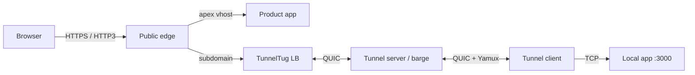

# TunnelTug

TunnelTug exposes local HTTP services to the internet through a **QUIC control tunnel** and a **streaming-optimized public ingress**. It supports subdomain and direct routing, HTTPS + HTTP/3, product **vhosts**, load-balanced **barges**, **mesh** registration, and namespace orchestration.

## Features

- **QUIC control channel** — Clients connect over UDP with TLS (`ALPN: tunneltug`)
- **Yamux multiplexing** — Many concurrent HTTP/WebSocket streams over one control connection
- **Streaming ingress** — Reverse proxy tuned for SSE, long bodies, and WebSocket upgrades
- **HTTP/3 public edge** — QUIC ingress with Alt-Svc; WebSocket upgrades on H3 supported
- **ACME / Let's Encrypt** — Automatic certificates in `-prod`
- **Subdomain or direct routing** — Multi-tenant hosts or a single shared tunnel
- **Load balancer** — Sticky or round-robin backends; dynamic barge registration
- **Barge fleets** — Horizontal tunnel backends; **k3s by default** (production), `process` for local development
- **k3s barges** — Rolling StatefulSet pods that self-register with the LB (stay up across other deploys)
- **Orchestrator** — Namespace-aware control + ingress for multi-fleet ops
- **Product vhosts** — Co-host apex/www apps next to tunnel subdomains (`-vhosts`)
- **Built-in mesh** — `secure_dns` + `secure_registrar` private zone (default `*.tunneltug.tunnel`) without an external platform
- **VPI stub** — Local resolver for private TLDs (`.tunnel` / `.mesh` / `.social`)

## Architecture



| Port | Protocol | Purpose |
|------|----------|---------|
| `443` / `-public` | TCP (HTTPS), UDP (HTTP/3) | Public HTTP ingress |
| `9000` / `-control` | UDP (QUIC) | Tunnel control channel |
| `80` | TCP | ACME HTTP-01 (`-prod`, when `-acme-http`) |

## Modes

| Mode | Purpose |
|------|---------|
| `client` | Expose local `-local` as a public subdomain (or mesh host) |
| `server` | Accept tunnels + serve public ingress (or backend behind LB) |
| `lb` | Front many servers; sticky/RR + dynamic barge registration |
| `barge` | Fleet of server backends (**k3s** default; `process` for dev) |
| `orchestrator` | Namespace-aware LB + control plane |

## Quick start

### Build

```bash
git clone https://github.com/TunnelTug/tunneltug.git
cd tunneltug
make build
```

### Development (self-signed TLS)

**Server:**

```bash
./bin/tunneltug \
  -mode server \
  -dev \
  -domain localhost \
  -token "$(openssl rand -hex 24)" \
  -public 8443
```

**Client:**

```bash
./bin/tunneltug \
  -mode client \
  -server 127.0.0.1 \
  -control 9000 \
  -local 3000 \
  -subdomain myapp \
  -token "<same-token>" \
  -insecure
```

Visit `https://myapp.localhost:8443` (add `127.0.0.1 myapp.localhost` to `/etc/hosts` if needed).

### Production (simple direct tunnel)

Single shared tunnel on the apex domain — no subdomains, no mesh required:

**Server** (DNS `A`/`AAAA` for `example.com`, open 80, 443/tcp, 443/udp, control/udp):

```bash
./bin/tunneltug \
  -mode server \
  -prod \
  -routing direct \
  -domain example.com \
  -email admin@example.com \
  -token "$(openssl rand -hex 32)"
```

**Client:**

```bash
./bin/tunneltug \
  -mode client \
  -prod \
  -routing direct \
  -domain example.com \
  -local 3000 \
  -token "<same-token>"
```

Visit `https://example.com` (and `https://www.example.com` when DNS points there).

### Production (subdomain routing)

**Server** (include a wildcard or per-host SANs for ACME):

```bash
./bin/tunneltug \
  -mode server \
  -prod \
  -domain example.com \
  -subalt '*.example.com' \
  -email admin@example.com \
  -token "$(openssl rand -hex 32)"
```

**Client:**

```bash
./bin/tunneltug \
  -mode client \
  -server tunnel.example.com \
  -domain example.com \
  -subdomain myapp \
  -local 3000 \
  -token "<same-token>"
```

## Custom TLDs / domains + DoH (YAML)

Point the local VPI DNS stub at **your** private TLDs and domains, each with its own **DNS-over-HTTPS** resolver (RFC 8484) or classic `host:port` upstream.

```bash
./bin/tunneltug -mode client \
  -server tunnel.example.com -local 3000 -subdomain myapp -token "$TOKEN" \
  -dns config/dns.yaml
```

Or set `TUNNELTUG_DNS=/path/to/dns.yaml`. Loading a DNS file enables the stub automatically (`-vpi-stub`).

```yaml
# config/dns.yaml (see config/dns.example.yaml)
listen: 127.0.0.1:5354
fallback: https://cloudflare-dns.com/dns-query   # or 8.8.8.8:53

zones:
  - tld: corp
    doh: https://dns.corp.example/dns-query

  - domains:
      - services.internal
      - "*.lab.internal"
    doh: https://doh.lab.example/dns-query

  - tld: tunnel
    domains:
      - tunneltug.tunnel
    upstream: 127.0.0.1:5353          # classic DNS; optional doh + upstream fallback
```

| Field | Purpose |
|-------|---------|
| `listen` | Local UDP stub address (default `-vpi-listen`) |
| `fallback` | Resolver when no zone matches (`host:port` or DoH URL) |
| `default_doh` / `default_upstream` | Used when a zone matches but omits its own resolver |
| `private_tlds` | Extra private labels without a dedicated zone block |
| `zones[].tld` | Single label (e.g. `corp`) — matches `*.corp` |
| `zones[].domains` | Exact names, suffixes, or `*.suffix` patterns |
| `zones[].doh` | DoH base URL (`POST` `application/dns-message` by default) |
| `zones[].doh_method` | `post` (default) or `get` |
| `zones[].upstream` | Classic DNS `host:port` (also DoH failure fallback) |

Match preference: exact domain → domain suffix / wildcard → TLD. Point the OS or app resolver at the stub listen address for private names.

## Built-in mesh network

TunnelTug embeds **secure_dns** + **secure_registrar** so a server (or LB) can operate its own private mesh zone without 0Trust platform. Default product zone: `tunneltug.tunnel` under TLD `.tunnel`.

**Server (authority):**

```bash
./bin/tunneltug -mode server -dev -domain localhost -public 8443 \
  -token "$TOKEN" -mesh -mesh-dns 127.0.0.1:5353 -mesh-edge-ip 127.0.0.1
```

On each tunnel connect, the authority publishes `{subdomain}.tunneltug.tunnel` → edge IP.

**Client (publish + local resolve):**

```bash
./bin/tunneltug -mode client \
  -server 127.0.0.1 -control 9000 -public 8443 \
  -domain localhost -subdomain myapp -local 3000 \
  -token "$TOKEN" -insecure -mesh
```

- Private name: `myapp.tunneltug.tunnel`
- VPI stub (auto-on with `-mesh`): `127.0.0.1:5354` → forwards private TLDs to mesh DNS
- HTTP registry: `GET /_tunneltug/mesh/status`, `POST /_tunneltug/mesh/register` (token auth)

Optional external platform join (legacy/advanced): add `-mesh-join-platform` and/or `-mesh-gateway` / `-mesh-pubkey`.

## Load balancer + barge

```bash
# LB
./bin/tunneltug -mode lb -domain example.com -subalt '*.example.com' \
  -public 8444 -control 9000 -lb-dynamic=true -lb-policy sticky \
  -prod -acme-http=false -token "$TOKEN"

# Production: k3s is the default barge runtime (rolling pods, no hard fleet reset)
./bin/tunneltug -mode barge -barge-service server -barge-replicas 2 \
  -control 9001 -public 8445 -barge-port-step 1 \
  -barge-lb lb.example.com:8444 \
  -k3s-image tunneltug:1.2.3 \
  -k3s-kubeconfig /etc/rancher/k3s/k3s.yaml \
  -token "$TOKEN" -domain example.com -backend-insecure

# Development only: local multi-process supervisor
./bin/tunneltug -mode barge -barge-runtime process -barge-service server -barge-replicas 2 \
  -control 9001 -public 8445 -barge-host 127.0.0.1 \
  -barge-lb 127.0.0.1:8444 -token "$TOKEN"
```

LB registration endpoints: `POST /_tunneltug/lb/register`, `/heartbeat`, `/deregister`.

### k3s barges (production default)

`-barge-runtime` defaults to **`k3s`**. Each replica is a StatefulSet pod with **hostNetwork**, ordinal ports, and **self-registration** so:

- Other host services can update without stopping barges
- Barge image rolls replace one pod at a time (LB keeps ≥ N−1 backends)
- Requires `-k3s-image` (or `TUNNELTUG_K3S_IMAGE`) and a reachable cluster

```bash
# Controller reconciles StatefulSet (pods keep running if controller exits)
./bin/tunneltug -mode barge -barge-replicas 2 \
  -control 9001 -public 8445 -barge-lb lb.example.com:8444 \
  -k3s-image tunneltug:dev \
  -k3s-kubeconfig /etc/rancher/k3s/k3s.yaml \
  -token "$TOKEN" -domain example.com -backend-insecure

# Or apply static manifests
kubectl apply -f deploy/k3s/
kubectl -n tunneltug set image sts/tunneltug-barge tunneltug=tunneltug:1.2.4
```

Use **`-barge-runtime process`** only for local development (one parent, N children; restart kills the whole fleet).

Each pod runs `-mode server -index-from-hostname -register-lb …` with `TUNNELTUG_REGISTER_HOST` from the node IP (Downward API). See `deploy/k3s/README.md`.

Server self-registration (any environment):

```bash
./bin/tunneltug -mode server -control 9001 -public 8445 \
  -register-lb lb.example.com:8444 -register-host 10.0.0.5 \
  -token "$TOKEN"
```

### Barge / server snapshots

Enable durable tunnel inventory across restarts and rolling updates:

```bash
./bin/tunneltug -mode server \
  -snapshot-dir /var/lib/tunneltug/snapshots \
  -snapshot-on-shutdown -snapshot-restore \
  ...
```

| When | What |
|------|------|
| SIGTERM / roll | Write JSON snapshot (tunnels, ports, LB, mesh flag) |
| Start | Restore mesh publishes + mark tunnels **pending reconnect** |
| k3s controller image change | `POST /_tunneltug/snapshot` on ready pods first |
| Manual | `POST /_tunneltug/snapshot` with `X-TunnelTug-Token` |

Live QUIC/yamux sessions are not serializable — clients reconnect; snapshot keeps DNS/mesh and ops visibility (`pending_tunnels` on `/_tunneltug/health`).

## Product vhosts (server / lb)

Co-host product apex domains next to tunnel subdomains:

```yaml
# config/vhosts.example.yaml
platform_url: https://0trust.cloud
cloud_domain: 0trust.cloud
acme_domains:
  - tunneltug.com
vhosts:
  - domain: tunneltug.com
    upstream: http://127.0.0.1:3082
    auth_proxy: false
    wildcard_subdomains: false   # myapp.tunneltug.com stays a tunnel
```

```bash
./bin/tunneltug -mode server -prod -domain tunneltug.com \
  -email admin@example.com -token "$TOKEN" \
  -vhosts config/vhosts.yaml
```

| Host | Route |
|------|--------|
| `tunneltug.com` / `www` | Product vhost → upstream |
| `myapp.tunneltug.com` | Tunnel when `wildcard_subdomains: false` |
| `site.motionkb.com` | Vhost when `wildcard_subdomains: true` |

Optional `auth_proxy: true` proxies `/auth/*`, `/samln/*`, and related IdP paths to `platform_url`. Use `upstream: "cloud://8443"` with `cloud_backhaul` for private platform hops.

## Configuration

### Core flags

| Flag | Default | Description |
|------|---------|-------------|
| `-mode` | `client` | `server`, `client`, `lb`, `barge`, `orchestrator` |
| `-routing` | `subdomain` | `subdomain` or `direct` |
| `-token` | — | Shared auth secret (min 8; 16 in `-prod`) |
| `-control` | `9000` | QUIC control port (UDP) |
| `-public` | `8080` | Public HTTP(S)/HTTP/3 port |
| `-local` | `3000` | Local app port (client) |
| `-subdomain` | `myapp` | Tunnel name |
| `-namespace` | `default` | Logical namespace |
| `-domain` | — | Primary domain (`-prod` / `-dev`) |
| `-subalt` | — | Extra SANs |
| `-prod` / `-dev` | `false` | ACME or self-signed TLS |
| `-http3` | `true` | HTTP/3 when TLS enabled |
| `-vhosts` | — | Product vhost YAML/JSON |
| `-insecure` | `false` | Skip TLS verify (client, dev only) |
| `-version` | — | Print version |

### LB / barge / mesh flags

| Flag | Default | Description |
|------|---------|-------------|
| `-backends` | — | `host[:control[:public]]` list |
| `-lb-policy` | `sticky` | `sticky` or `round-robin` |
| `-lb-dynamic` | `true` | Accept barge registration |
| `-lb-register-ttl` | `45` | Prune unresponsive barges (s) |
| `-barge-service` | `server` | `server` or `client` |
| `-barge-replicas` | `1` | Process/pod count |
| `-barge-runtime` | `k3s` | `k3s` (production) or `process` (development) |
| `-barge-lb` | — | LB `host:port` for registration |
| `-barge-fleet-id` | — | Fleet id on heartbeats |
| `-k3s-image` | — | Container image (required for k3s runtime) |
| `-k3s-kubeconfig` | — | Kubeconfig (else in-cluster / `~/.kube/config`) |
| `-k3s-namespace` | `tunneltug` | Workload namespace |
| `-k3s-host-network` | `true` | hostNetwork for QUIC (recommended) |
| `-k3s-cleanup` | `false` | Delete StatefulSet when controller exits |
| `-register-lb` | — | Server self-registration LB `host:port` |
| `-register-host` | — | Address advertised to LB (node IP on k3s) |
| `-index-from-hostname` | `false` | Port base + step from hostname `…-N` |
| `-snapshot-dir` | — | Dir for barge/server state snapshots (empty = off) |
| `-snapshot-on-shutdown` | `true` | Write snapshot before graceful exit |
| `-snapshot-restore` | `true` | Restore latest snapshot on server start |
| `-snapshot-interval` | `0` | Periodic snapshot seconds (`0` = off) |
| `-snapshot-keep` | `5` | Snapshots retained per identity |
| `-mesh` | `false` | Built-in mesh DNS+registrar (server/lb authority; client publish) |
| `-mesh-dns` | `127.0.0.1:5353` | Authoritative mesh DNS listen (server/lb) |
| `-mesh-zone` | `tunneltug.tunnel` | Product root zone |
| `-mesh-tld` | `tunnel` | Private TLD |
| `-mesh-edge-ip` | auto | A-record edge IP |
| `-mesh-join-platform` | `false` | Also join external 0Trust platform mesh |
| `-vpi-stub` | `false` | Local private-TLD DNS stub (auto with `-mesh` client or `-dns`) |
| `-vpi-upstream` | mesh-dns | Authoritative NS for private names |
| `-vpi-listen` | `127.0.0.1:5354` | Stub listen address |
| `-dns` | — | YAML/JSON custom TLDs/domains + DoH zones |
| `-acme-http` | `true` | Bind `:80` for ACME |
| `-acme-cache` | `certs-cache` | Cert cache directory |

### Environment variables

| Variable | Maps to |
|----------|---------|
| `TUNNELTUG_TOKEN` | `-token` |
| `TUNNELTUG_DOMAIN` | `-domain` |
| `TUNNELTUG_SERVER` | `-server` |
| `TUNNELTUG_SUBDOMAIN` | `-subdomain` |
| `TUNNELTUG_BACKENDS` | `-backends` |
| `TUNNELTUG_VHOSTS` | `-vhosts` |
| `TUNNELTUG_BARGE_LB` | `-barge-lb` |
| `TUNNELTUG_BARGE_FLEET_ID` | `-barge-fleet-id` |
| `TUNNELTUG_MESH` | `-mesh` |
| `TUNNELTUG_MESH_DNS` | `-mesh-dns` |
| `TUNNELTUG_MESH_ZONE` | `-mesh-zone` |
| `TUNNELTUG_MESH_TLD` | `-mesh-tld` |
| `TUNNELTUG_MESH_EDGE_IP` | `-mesh-edge-ip` |
| `TUNNELTUG_MESH_JOIN_PLATFORM` | `-mesh-join-platform` |
| `TUNNELTUG_MESH_PLATFORM` | `-mesh-platform` |
| `TUNNELTUG_MESH_GATEWAY` | `-mesh-gateway` |
| `TUNNELTUG_MESH_PUBKEY` | `-mesh-pubkey` |
| `TUNNELTUG_VPI_STUB` | `-vpi-stub` |
| `TUNNELTUG_VPI_UPSTREAM` | `-vpi-upstream` |
| `TUNNELTUG_VPI_LISTEN` | `-vpi-listen` |
| `TUNNELTUG_DNS` | `-dns` |

## Docker

```bash
docker build -t tunneltug:latest .

docker run --rm -p 8080:8080/tcp -p 8443:8443/tcp -p 8443:8443/udp -p 9000:9000/udp \
  tunneltug:latest \
  -mode server -dev -domain localhost -public 8443 \
  -token "$(openssl rand -hex 24)"
```

## Health check

```
GET /_tunneltug/health
```

```json
{"status":"ok","routing":"subdomain","http3":true,"vhosts":0,"active_streams":0,"total_streams":0}
```

LB also exposes `/_tunneltug/lb/register`, `/heartbeat`, `/deregister` when dynamic registration is enabled.

## Security notes

- Always use a strong random `-token` in production (32+ bytes recommended).
- Do not use `-insecure` outside local development.
- Open **UDP** for the control port and HTTP/3; TCP alone is not sufficient.
- Keep `wildcard_subdomains: false` on tunnel product domains so user subdomains stay tunnels.
- WebSocket/SSE work over HTTPS and HTTP/3.

## Development

```bash
make test    # unit tests + race detector
make vet     # go vet
make lint    # requires golangci-lint
```

CI runs on every push via GitHub Actions (`.github/workflows/ci.yml`).

Public product docs: [https://tunneltug.com/docs](https://tunneltug.com/docs)

## License

MIT — see [LICENSE](LICENSE).
